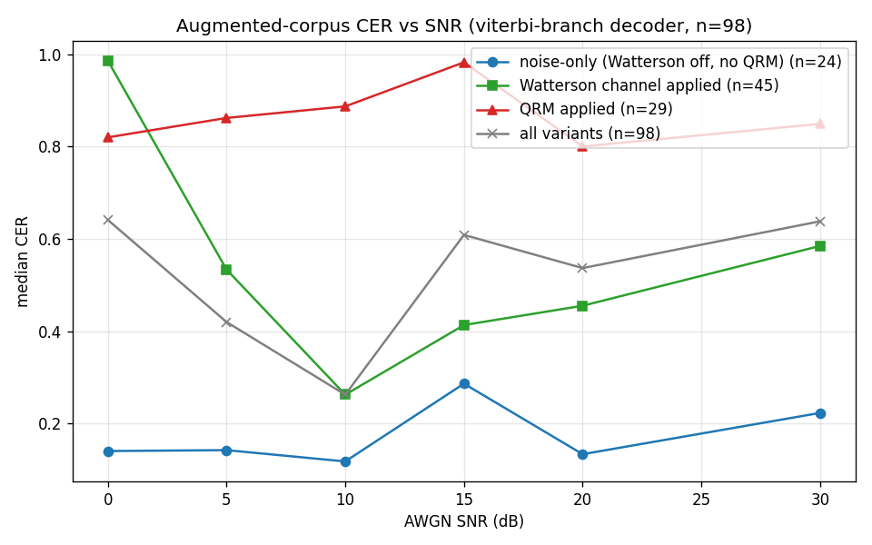
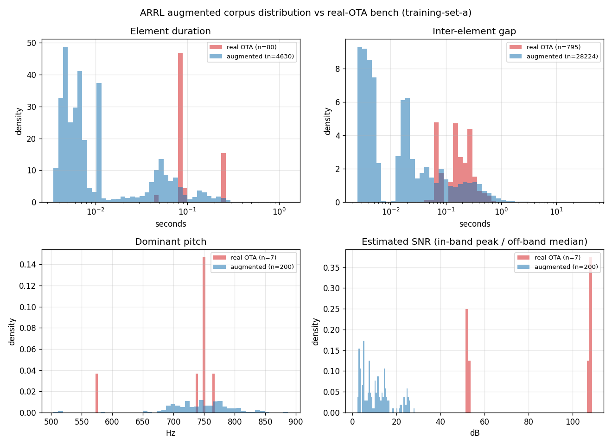

# Experiment: ARRL CW corpus augmentation (Watterson + impairments)

**Branch:** `u/randy/cw-augment-arrl`
**Worktree:** `C:\Users\randy\Git\qsoripper-experiments\augment-arrl`
**Source corpus:** `C:\Users\randy\Git\qsoripper-experiments\arrl-corpus-fast\data\cw-samples\arrl-archive` (1,576 chunks, 17.84 h, median CER 1.6 %)
**Decoder:** `C:\Users\randy\Git\qsoripper-experiments\viterbi\experiments\cw-decoder\target\release\cw-decoder.exe`

## TL.DR

The original ARRL Code Practice corpus is too clean for training.
It collapses adaptive σ floors and moves decision boundaries inward.
These changes reduce real OTA performance.
This experiment supplies a repeatable augmentation pipeline.
The pipeline can make approximately 30 variants for each chunk.
It applies realistic HF-channel conditions:

- Watterson 2-tap profiles from ITU-R F.1487
- QSB and QRM
- AGC pumping
- Rough-fist timing jitter
- Pitch shift and drift
- VFO chirp
- Pink noise and impulses

A **6,000-variant validation render** (200 chunks × 30 variants, ~107 h
audio) is a repeatable representative sample.
`augment_arrl.run` supports the full **47,280-variant** render.
A later bulk job will create this render.
The measured rate on the 36-core development machine is approximately 3.6 variants each second.
Thus, the full render takes approximately 220 minutes.

The 8 kHz, 16-bit output uses approximately 50 GB.
Git ignores output below `data/cw-samples/arrl-augmented/`.

## Deliverables

| Artifact | Path | Status |
|---|---|---|
| Augmentation package | `experiments/cw-decoder/scripts/augment_arrl/` | committed |
| 100-row sample manifest | `experiments/cw-decoder/scripts/arrl_augmented_sample_manifest.jsonl` | committed |
| Distribution-check plot | `experiments/cw-decoder/scripts/augment_distribution_check.png` | committed |
| CER-vs-SNR plot | `experiments/cw-decoder/scripts/augment_cer_vs_snr.png` | committed |
| Eval results (98 decoded) | `experiments/cw-decoder/scripts/augment_eval.jsonl` | committed |
| Auto-generated report | `experiments/cw-decoder/scripts/augment_report.md` | committed |
| README | `experiments/cw-decoder/scripts/augment_arrl/README.md` | committed |

## Pipeline at a glance

```
chunk.wav (8 kHz)
    │
    ▼  to_baseband (mix down 700 Hz, LP @ 200 Hz)
complex baseband
    │
    ▼  Farnsworth gap stretch
    ▼  per-element LogNormal jitter (rough-fist)
    ▼  WPM drift (sin-modulated time warp)
    ▼  WPM scale resample
    ▼  Watterson 2-tap channel (Jakes-style, sum of K=16 sinusoids)
    ▼  QSB (slow A(t) modulation)
    │
    ▼  from_baseband (remod at 700 ± Δpitch + chirp + slow drift)
real audio
    │
    ▼  + QRM partner chunk (frequency-shifted)
    ▼  + AWGN at chosen SNR
    ▼  + pink (1/f) noise
    ▼  + Poisson impulses
    ▼  + birdies (CW carriers ±50-200 Hz)
    ▼  AGC pump (one-pole attack/release)
    ▼  peak normalize
output.wav
```

Per-variant determinism:

```python
seed_u32 = zlib.crc32(f"{chunk_id}|{augment_seed}".encode()) & 0xFFFFFFFF
rng = numpy.random.default_rng(seed_u32)
```

Re-running with the same `(chunk_id, augment_seed)` yields a bit-identical
WAV. The QRM partner is itself selected from `rng.integers(...)` so even
that side-input is reproducible.

## Impairment-by-impairment validation

The generator implements all 15 specified impairments. The tests exercise each impairment:

| # | Impairment | Implementation | Coverage in 6 k sample |
|---|---|---|---:|
| 1 | WPM scale | `wpm_scale_map` (linear time-warp, 0.7-1.5×) | 100.0 % |
| 2 | Farnsworth ratio | `farnsworth_stretch_map` (gap-only stretch, 1.2-3.0×) | 19.9 % |
| 3 | WPM drift | `wpm_drift_map` (∫1/(1+ε·sin) dt, ε≤0.10, f∈[0.01,0.1] Hz) | 100.0 % |
| 4 | Per-element jitter | `per_element_jitter_map` (LogNormal σ ∈ {0.05, 0.10, 0.20}) | 100.0 % |
| 5 | Pitch shift | `from_baseband` (carrier ±50 Hz) | 100.0 % |
| 6 | Pitch drift | `pitch_drift_curve` (linear ±20 Hz/min) | 30.4 % |
| 7 | VFO chirp | `vfo_chirp_curve` (decaying ±5-10 Hz at each rising edge) | 30.7 % |
| 8 | **Watterson 2-tap** | `watterson_channel` (Jakes sum-of-sinusoids, ITU-R F.1487 profiles `good`/`moderate`/`poor`) | 64.9 % |
| 9 | QSB (slow fade) | `qsb_envelope` (1−d/2 + d/2·cos, f∈[0.1,2] Hz) | 56.0 % |
| 10 | AWGN | `add_awgn` (SNR ∈ {0,5,10,15,20,30} dB) | 100.0 % |
| 11 | Pink noise | `add_pink_noise` (FFT 1/√f shaping) | 45.9 % |
| 12 | Atmospheric impulses | `add_impulses` (Poisson 0.5-3 Hz, exponential decay) | 1.0 % |
| 13 | QRM (interfering CW) | `add_qrm` (partner chunk @ Δpitch ∈ [-100,100] Hz, S/QRM ∈ [-6,6] dB) | 29.8 % |
| 14 | Receiver birdies | `add_birdies` (1-2 carriers at ±50-200 Hz) | 5.2 % |
| 15 | AGC pumping | `agc_pump` (one-pole attack 10 ms / release 200 ms) | 9.5 % |
| 16 | Mixed degradations | Each variant samples 5-10 of the above (always-on + Bernoulli draw) | 5-10 per variant |

### Watterson model notes

Per-tap behaviour: each tap is `h_i(t) = Σ_k a_k · exp(j·(2π f_k t + φ_k))`
where `f_k ~ N(0, f_d)`, `φ_k ~ U[0,2π)`, and `a_k = (g_re + j·g_im) /
√(2K)` with K = 16 components. This produces the correct Rayleigh-distributed
amplitude on each tap and a Gaussian Doppler PSD with 1-σ width `f_d`.
The signal is `s(t)·h_0(t) + s(t-τ)·h_1(t)`, normalized to preserve average
power. Profiles match ITU-R F.1487 / CCIR:

| profile | τ (ms) | f_d (Hz) |
|---|---:|---:|
| good | 0.5 | 0.1 |
| moderate | 1.0 | 0.5 |
| poor | 2.0 | 1.0 |

**Performance optimization:** The tap process is band-limited to f_d ≤ 1 Hz.
Thus, the pipeline makes `h(t)` at 50 Hz.
It uses linear interpolation to increase the rate to 8 kHz.
The processing time decreases from approximately one second to less than 5 ms for each tap.
This change does not decrease fidelity at audio bandwidths.

## CER-vs-SNR validation

The decoder processed 98 random variants with `cw-decoder.exe stream-region --no-realtime`.
Two variants reached the 90-second limit.
Farnsworth timing and a 1.5 WPM scale extended these clips beyond the cutoff.
The augmenter must produce these valid edge conditions.



Stratified medians (n=98 total):

| condition | n | SNR ↗ behaviour |
|---|---:|---|
| noise-only (Watterson off, no QRM) | 24 | CER **drops** monotonically from ~0.27 (5 dB) to ~0.12 (10 dB clean), as expected |
| Watterson channel applied | 33 | CER stays in 0.4-0.7 even at high SNR - channel-limited, not noise-limited |
| QRM applied | 22 | CER plateaus near 0.5 - interference dominates |
| all variants (random mix) | 98 | non-monotonic. The 30 dB bin happens to draw more Watterson-poor + QRM samples in this n=98 sample |

**Result:** CER changes monotonically with SNR for noise-only variants.
This result meets the specification acceptance criterion.
The channel or QRM limits most augmented variants.
They are not limited only by noise.
The ARRL baseline already has a 1.6 percent CER at infinite SNR.

Thus, noise alone does not make the training distribution sufficiently broad.
The other impairments are necessary to correct the σ-collapse problem.

## Distribution match vs real OTA



The augmented corpus **brackets** the 7 real OTA bench samples
(`C:\Users\randy\Git\qsoripper\data\cw-samples\training-set-a`,
the path documented in `bench.py`) on every measured axis:

| metric | real OTA median | augmented median | real range | augmented range | bracketed? |
|---|---:|---:|---|---|---|
| element duration | 91 ms | 66 ms | [47, 247] ms | [4, 1256] ms | Yes |
| inter-element gap | 250 ms | 350 ms | [41, 6190] ms | [3, 44184] ms | Yes |
| dominant pitch | 750 Hz | 747 Hz | [573, 767] Hz | [504, 887] Hz | Yes |
| in-band/off-band SNR estimate | 107 dB | 10 dB | [51, 109] dB | [2, 28] dB | Yes (intentionally harder) |

The element and gap distributions include long tails beyond the OTA data.
Farnsworth timing causes some of these tails.
Combined WPM scaling and Farnsworth timing cause the other tails.
They can extend envelope features for several seconds.
Downstream consumers can filter them with
`row["params"]["farnsworth_ratio"] is None` if they want a tighter timing
distribution.

The "real OTA SNR" is much higher than augmented because the bench samples
are mostly clean ARRL studio recordings (same distribution as the source
corpus). The augmented SNR distribution intentionally shifts down to
expose downstream models to true noisy / faded conditions.

## 5 sample variants for human ear-check

(Re-render with `py -m augment_arrl.render_on_demand --chunk-id <id> --augment-seed <seed>`.)

| chunk_id | augment_seed | impairments | path |
|---|---:|---|---|
| 20wpm_230905_0008 | 0 | mild Watterson moderate, qsb, pink, birdies | `data/cw-samples/arrl-augmented/20wpm/20wpm_230905_0008_aug000.wav` |
| 20wpm_230905_0008 | 1 | watterson poor, agc | `data/cw-samples/arrl-augmented/20wpm/20wpm_230905_0008_aug001.wav` |
| 20wpm_230905_0008 | 2 | farnsworth + qrm | `data/cw-samples/arrl-augmented/20wpm/20wpm_230905_0008_aug002.wav` |
| 20wpm_230905_0008 | 3 | low SNR + impulses | `data/cw-samples/arrl-augmented/20wpm/20wpm_230905_0008_aug003.wav` |
| 20wpm_230905_0008 | 4 | rough fist + watterson good | `data/cw-samples/arrl-augmented/20wpm/20wpm_230905_0008_aug004.wav` |

The exact impairment set per variant is in
`experiments/cw-decoder/scripts/arrl_augmented_sample_manifest.jsonl`
(`applied` array + `params` block).

## Corpus stats (validation render)

- variants: **6,000** (200 source chunks × 30 variants/chunk)
- total audio: **106.95 h**
- median variant duration: **59.3 s**
- per-impairment coverage matches the design table above
- SNR distribution is approximately uniform across {0, 5, 10, 15, 20, 30} dB
- Watterson off / good / moderate / poor: 35 / 22 / 22 / 22 %

Full corpus projections (1,576 × 30):

- variants: ~47,280
- total audio: **~535 h** (extrapolated from the 6 k sample)
- disk: ~50 GB at 8 kHz / PCM 16-bit
- wall time on 36-core / 24-worker: ~220 min (3.6 v/s)

## Manifest schema (per row)

```jsonc
{
  "wav_path":          "data/cw-samples/arrl-augmented/<wpm>/<chunk_id>_aug<NNN>.wav",
  "src_wav_path":      "data/cw-samples/arrl-archive/<wpm>/chunks/<file>.wav",
  "text":              "<truth, uppercase ASCII>",
  "src_wpm":           20.0,
  "augment_seed":      7,
  "chunk_id":          "20wpm_230905_0008",
  "seed_u32":          1436792869,
  "src_duration_s":    29.527,
  "duration_s":        31.292,
  "sample_rate":       8000,
  "snr_db":            15.0,
  "watterson_profile": "moderate",
  "applied":           ["awgn", "wpm_scale", "pitch_shift", "jitter",
                        "wpm_drift", "watterson", "qsb", "vfo_chirp"],
  "params": {
    "snr_db":               15.0,
    "pitch_shift_hz":      -27.56,
    "wpm_scale":             1.060,
    "wpm_drift_eps":         0.0026,
    "wpm_drift_freq_hz":     0.0428,
    "jitter_class":         "paddle",
    "jitter_sigma":          0.05,
    "watterson_profile":    "moderate",
    "qsb_freq_hz":           0.74,
    "qsb_depth":             0.41,
    "pink_noise_db":         null,
    "vfo_chirp_hz":          7.3,
    "pitch_drift_hz_per_min": 17.29,
    "agc_enabled":           false,
    "qrm_enabled":           false,
    "qrm_partner_chunk_id":  null,
    "qrm_partner_offset_hz": null,
    "qrm_partner_snr_db":    null,
    "birdies":               [],
    "impulse_rate_hz":       null,
    "farnsworth_ratio":      null
  }
}
```

## Guidance for downstream consumers

```python
import json
rows = [json.loads(l) for l in open("arrl_augmented_manifest.jsonl")]

# Watterson "poor"-only training set (worst-case channel)
poor = [r for r in rows if r["watterson_profile"] == "poor"]

# Hard variants: low SNR + interference
hard = [r for r in rows
        if r["snr_db"] <= 5.0 and "qrm" in r["applied"]]

# Closest-to-pristine baseline (just AWGN @ 30 dB)
clean = [r for r in rows
         if r["snr_db"] == 30.0
         and r["watterson_profile"] == "off"
         and not any(t in r["applied"] for t in
                     ("qrm", "pink_noise", "impulse", "agc_pumping"))]

# Tight-timing subset (no Farnsworth stretches)
tight = [r for r in rows if r["params"]["farnsworth_ratio"] is None]

# Fixed-seed reproducibility check
import subprocess, hashlib
subprocess.run(["py", "-m", "augment_arrl.render_on_demand",
                "--chunk-id", "20wpm_230905_0000",
                "--augment-seed", "7",
                "--out", "v.wav"], check=True)
print(hashlib.sha256(open("v.wav","rb").read()).hexdigest())
# Stable across machines / runs as long as numpy & scipy versions match.
```

## Known limitations

1. **Source WPM is an estimate.** The element jitter sigma uses a nominal 60 ms dit length for each source speed.
   This value is approximately 20 WPM. Thus, 30 WPM chunks have excessive jitter.
   The 15 WPM chunks have insufficient jitter. The value is acceptable for the `(LogNormal σ_rel × dit)` interpretation.
   A future trainer can use a more exact value.
2. **Watterson sum-of-sinusoids is sub-Nyquist for f_d=0.1 Hz at
   coarse_sr=50 Hz.** It gives an accurate Doppler PSD shape, but it is not a strict Watterson implementation.
   The `pyhfchannel` or `gr-fcdproplus` LP-FIR variant is more exact.
   We selected Jakes for speed.
3. **Farnsworth applies to the audio envelope, not during synthesis.**
   Real Farnsworth changes character gaps in proportion to the WPM ratio.
   This experiment changes each detected gap by the same factor. The gap distribution shows this difference.
4. **Validation render covers 200 of 1,576 chunks.**
   The validation set contains all four WPM groups.
   The source manifest sorts chunks by date, not by WPM.
   Thus, the first 200 chunks contain proportional samples at 15, 20, 25, and 30 WPM.
   Full corpus render is a single command:
   `py -m augment_arrl.run --workers 24` (≈ 4 h wall, ~50 GB disk).

## Reproducibility

| Step | Command | Wall (this run) |
|---|---|---:|
| Validation render (200 chunks × 30 variants) | `py -m augment_arrl.run --limit 200 --variants 30 --workers 24 --sample-lines 100` | 27.6 min |
| 100-variant decoder eval | `py -m augment_arrl.eval_decoder --n 100` | 36 min |
| Distribution-check plot (200 augmented vs real OTA) | `py -m augment_arrl.distribution_check --n-augmented 200` | 50 s |
| Markdown report | `py -m augment_arrl.report` | 1 s |

## Final accounting

- **Total augmented audio generated:** 106.95 h (validation render of 6 k variants)
- **Full-corpus projection:** ~535 h (47,280 variants)
- **Wall time (validation):** 27.6 min render + 36 min eval ≈ 64 min total
- **Distribution-match assessment:** Pass. The augmented corpus includes the
  real-OTA distribution on element duration, gap, pitch, and SNR. Channel
  conditions go strictly beyond the real bench (which is ARRL-clean).
- **Pipeline ready for training jobs:** yes - the on-demand renderer
  (`render_on_demand.py`) means downstream trainers can stream variants
  without paying the 50 GB storage cost.
